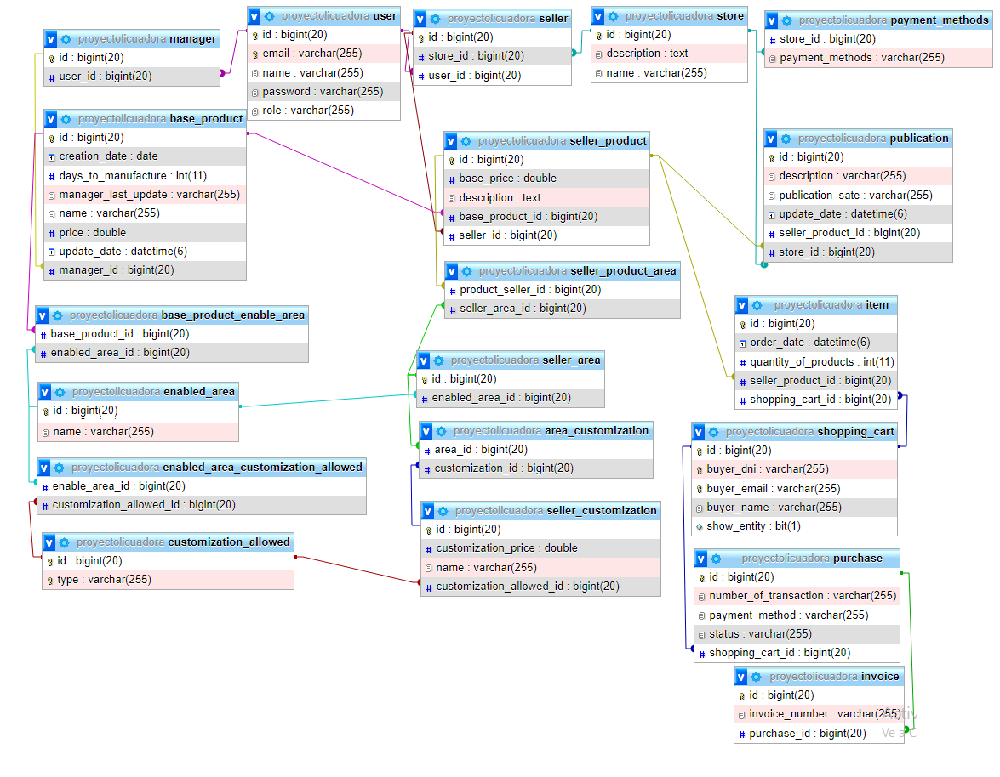

# ACADEMIA - SOFFTEK 
Java - Spring Boot (Proyecto: API REST) 
E- COMMERCE 🚀

## Desarrollado por 🖥️  [AndresRodriguez](https://www.linkedin.com/in/andres-rodriguez-60a166208/) - [GitHub](https://github.com/AndrRod) - [PortFolio](https://andresporfolio.herokuapp.com/)

### DEMO SWAGGER - HEROKU ->   [SWAGGER -HEROKU ](https://sofftek-e-commerce.herokuapp.com/swagger-ui/index.html#/) 🚀

El presente profyecto fue documentado a través de postman y swagger, y finalmente subido a la nube a través de la página HEROKU.
- Link en disponible seguidamente ->  [SWAGGER -HEROKU ](https://sofftek-e-commerce.herokuapp.com/swagger-ui/index.html#/)

### **Contexto general**
Nos han solicitado diseñar y desarrollar una plataforma de E-Commerce para la
venta de productos de indumentaria semi-personalizados.

### **Relevamiento**

Los gestores de la plataforma cargan los productos base que pueden ser personalizados y comercializados,
como, por ejemplo, remeras, gorras, fundas para smartphones, zapatillas, entre otros. Para cada producto
definen un nombre, un precio base, una descripción y un tiempo estimado de fabricación (ellos se encargan
de fabricarlos). A cada producto base se le debe definir el área de personalización y por cada una de éstas,
los tipos de personalizaciones que se podrán realizar. Por ejemplo: texto, imagen color, imagen blanco y
negro, emoji, entre otros.
Los vendedores, que son clientes de los gestores (pagan por el uso de la plataforma), pueden personalizar
cada uno de los productos que tienen a disposición, agregándole imágenes o frases para que sean
estampadas en las áreas predefinidas.
A cada personalización le definen un nombre y un precio, el cual se suma al precio base del producto para
formar el precio final de venta. Luego, pueden publicar dichos productos personalizados en su tienda (cada
vendedor tiene su propia tienda dentro de la plataforma). Los vendedores deben poder pausar y cancelar
sus publicaciones en cualquier momento.
Los compradores son considerados “esporádicos”, es decir, que no son frecuentes y no necesitan generarse
una cuenta en el sistema para poder realizar una compra.
Cabe destacar que la plataforma debe contemplar el concepto de “carrito de compra”, es decir, que el
comprador puede ir seleccionando todos los productos que quiera y luego comprarlos todos juntos.
Una vez que el cliente selecciona el o los productos personalizados, el sistema debe calcular el total de la
compra, para que, posteriormente, el comprador los pague por alguno de los medios de pago admitidos.
Cada vendedor define los Medios de Pago de acepta. Una vez aceptado el pago, se debe generar una
Factura Electrónica a partir de un Servicio Externo.

### **Pendientes**
- Verificar funcionamiento del todo el proyecto.-
- Mejorar comportamiento cuando se elimina un Usuario (quen no se elimine el manager que tiene creado productos o solo los productos, 
ni tampoco sellers que tienen pendiente la factura de compras realizadas)
- Falta Tests Unitarios.

### MODELADO DE BASE DE DATOS: 
